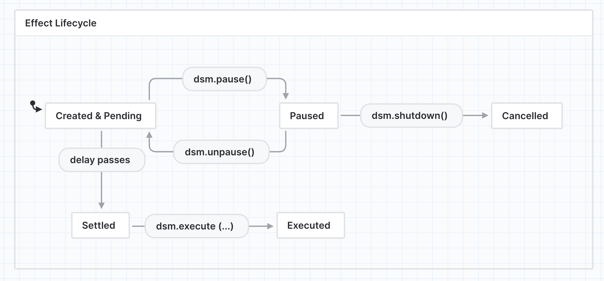

## Abstract

This standard outlines a smart contract interface for a Circuit Breaker that enables protocols to trigger a temporary halt on protocol-wide token outflows when a threshold is exceeded for a predefined metric. This circuit breaker does not assume the structure of the underlying protocol, and mainly serves as a pass-through vehicle for token outflows.

## Motivation

Security breaches have become pervasive in DeFi. Over $6 Billion dollars worth of assets were stolen in exploits. When something goes wrong, protocols are rapidly drained of the majority of TVL often in a matter of seconds. Although many protocols have smart contracts which are fully upgradeable by governance, in practice there is usually no time to upgrade or patch vulnerabilities before large amounts of TVL are drained.

Despite this, it is practically feasible to set a circuit breaker to be tripped in cases where an unusually large amount of tokens are withdrawn from a protocol in a short period of time. This will allow teams to take the necessary steps to fix their protocols, and save a significant portion of locked funds from being stolen. This will not prevent hacks, rather it will extend the actionable period that protocols have to address the situation.

## Specification

The key words "MUST", "MUST NOT", "REQUIRED", "SHALL", "SHALL NOT", "SHOULD", "SHOULD NOT", "RECOMMENDED", "NOT RECOMMENDED", "MAY", and "OPTIONAL" in this document are to be interpreted as described in RFC 2119 and RFC 8174.

### Definitions

- **Native Token/Asset:** The asset that's native to the EVM and transferred via top-level transactions or the `CALL`, `CREATE`, `CREATE2` or `SELFDESTRUCT` opcodes e.g on the Ethereum Mainnet the native token is the Ether (ETH) token.
- **Settlement:** The process by which the sphere of influence of an effect is changed e.g. an ERC20
  token transfer from a DeFi application to a user's EOA

### Delayed Settlement Module (DSM)

The DSM is the module responsible for keeping track of asset transfers and other effects that the
underlying app initiates but may have to be interrupted. Individual effects can be modeled as
a state machine:



A standard delayed settlement module MUST implement the following interface, as this is merely an
interface a DSM MAY include additional functions.

**`deferNativeTransfer`**

Records a delayed transfer of `CALLVALUE` (`msg.value` in Solidity & Vyper) native tokens to `to`.


```yaml
- name: deferNativeTransfer
  type: function
  stateMutability: payable

  inputs:
    - name: to
      type: address
```


### Volume-Based Rate Limiting

```
// SPDX-License-Identifier: CC0-1.0
pragma solidity 0.8.19;

/// @title Circuit Breaker
/// @dev See https://eips.ethereum.org/EIPS/eip-7265
interface IERC7265CircuitBreaker is ERC173 {
    /// @dev MUST be emitted in `onTokenOutflow` and `onNativeAssetOutflow` when an asset is successfully withdrawn
    /// @param asset MUST be the address of the asset withdrawn.
    /// For any EIP-20 token, MUST be an EIP-20 token contract.
    /// For the native asset (ETH on mainnet), MUST be address 0x0000000000000000000000000000000000000001 equivalent to address(1).
    /// @param recipient MUST be the address of the recipient withdrawing the assets
    /// @param amount MUST be the amount of assets being withdrawn
    event AssetWithdraw(address indexed asset, address indexed recipient, uint256 amount);

    /// @dev MUST be emitted in `claimLockedFunds` when a recipient claims locked funds
    /// @param asset MUST be the address of the asset claimed.
    /// For any EIP-20 token, MUST be an EIP-20 token contract.
    /// For the native asset (ETH on mainnet), MUST be address 0x0000000000000000000000000000000000000001 equivalent to address(1).
    /// @param recipient MUST be the address of the recipient claiming the assets
    event LockedFundsClaimed(address indexed asset, address indexed recipient);

    /// @notice Allow users to claim locked funds when rate limit is resolved
    /// @dev When a asset is transferred out during a rate limit period, the settlement may be delayed and the asset custodied in the circuit breaker.
    /// This method allows users to claim funds that were delayed in settlement after the rate limit is resolved or a grace period is activated.
    /// MUST revert if the recipient does not have locked funds for a given asset.
    /// MUST revert if circuit breaker is rate limited or is not operational.
    /// MUST transfer tokens or native asset (ETH on mainnet) to the recipient on successful call.
    /// MUST update internal accounting of circuit breaker implementation to reflect withdrawn balance on successful call.
    /// @param _asset To claim locked EIP-20 tokens, this MUST be an EIP-20 token contract.
    /// To claim native asset, this MUST be address 0x0000000000000000000000000000000000000001 equivalent to address(1).
    /// @param _recipient MUST be the address of the recipient of the locked funds from the circuit breaker
    function claimLockedFunds(address _asset, address _recipient) external;

    /// @notice Lock the circuit breaker
    /// @dev MAY be called by admin to lock the circuit breaker
    /// While the protocol is not operational: inflows, outflows, and claiming locked funds MUST revert
    function markAsNotOperational() external;

    /// @notice Migrates locked funds after exploit for recovery
    /// @dev MUST revert if the protocol is operational.
    /// MUST revert if caller is not the current admin.
    /// MUST transfer assets to recovery recipient on successful call.
    /// @param _assets Array of assets to recover.
    /// For any EIP-20 token, MUST be an EIP-20 token contract.
    /// For the native asset (ETH on mainnet), MUST be address 0x0000000000000000000000000000000000000001 equivalent to address(1).
    /// @param _recoveryRecipient The address of the recipient to receive recovered funds. Often this will be a multisig wallet.
    function migrateFundsAfterExploit(
        address[] calldata _assets,
        address _recoveryRecipient
    ) external;

    /// @notice View funds locked for a given recipient and asset
    /// @param recipient The address of the recipient
    /// @param asset To view the balance of locked EIP-20 tokens, this MUST be an EIP-20 token contract.
    /// To claim native ETH, this MUST be address 0x0000000000000000000000000000000000000001 equivalent to address(1).
    /// @return amount The locked balance for the given recipient and asset
    function lockedFunds(address recipient, address asset) external view returns (uint256 amount);
}
```

## Rationale

### Tracking token inflows to support percentage based rate limits

Circuit breakers implementations may support percentage based rate limiting. Percentage-based rate limiting is the recommended approach for protected protocols to use. Compared to having fixed notional token rate limits, this avoids the possibility that a team member will incorrectly update a token notional limit as TVL grows. In practice rate limits are always relative to total liquidity, so being able to know the total liquidity in the protected protocol is essential. In order to support percentage-based rate limiting, protocols integrating the standard must record notional token inflows using the applicable hook function.

### Choosing between delayed settlement or reverting on rate limit

Protocols can decide if withdrawal attempts should revert or custody tokens and delay settlement in the event of a circuit breaker trigger. It is possible that protocols can also expose this option to users and integration developers. Delayed settlement is beneficial for cases where token outflow or token withdrawal logic is mixed with other types of logic, for instance a withdrawal function that also closes a financial position. Reverting on such a function during a false positive rate limit would render users unable to close their positions and could potentially lead to liquidations or other negative externalities. On the other hand, third party integrations could assume that if a token withdrawal function is executed successfully that the full amount will be credited to them immediately, and therefore delayed settlement could create internal accounting errors. In those cases, reverting is preferred.

### Mandatory inclusion of post-hack recovery methods

While it would theoretically be possible to recover locked funds by upgrading the circuit breaker contract, the ability for the admin (representing protocol governance) to recover locked funds in the circuit breaker is mandatory in this standard to ensure that all implementations have this ability and funds are never locked in a circuit breaker due to the absence of upgradeability.

### Registering token parameters

By registering rate limit parameters for each token protected, protocols can set up different parameters for different tokens. Protocols can also opt to rate limit certain tokens, and not rate limit certain tokens. Tokens that are not registered will never be locked in the circuit breaker. The rationale for this is to give protocol governors the maximum flexibility in setting rate limits for their circuit breaker.

### Protecting numerous protocol contracts

The Circuit Breaker is designed to protect numerous contracts under the realm of a single protocol. This is important for protocols which have assets spread among many contracts, to use separate Circuit Breakers would not be effective.

### Extendability

The Circuit Breaker is designed as a minimum base standard. We expect many extensions to be built on the standard, including tokenized lock positions, compatibility with other standards, third party integrations and others.

### Minimum amount rate limited

When token balances are low during initial bootstrapping stages of a protocol lifecycle, there may be large fluctuations in total tokens locked. Governors can specify the minimum amount of total liquidity required for an asset to trigger a rate limit, and until that limit is reached, the asset will not trigger new rate limits. However, if a rate limit is triggered, the asset will still be locked.

## Backwards Compatibility

No backward compatibility issues found.

## Test Cases

Test cases can be found [here](../assets/eip-7265/test/core/user/CircuitBreakerUserOps.t.sol), [here](../assets/eip-7265/test/core/admin/CircuitBreakerEmergencyOps.t.sol), and [here](../assets/eip-7265/test/core/admin/CircuitBreakerAdminOps.t.sol).

## Reference Implementation

Reference Implementation can be found [here](../assets/eip-7265/src/core/CircuitBreaker.sol).

## Security Considerations

### Protocols Compatibility

When exploring the Circuit Breaker, it is important to carefully assess and understand which protocols are suitable for its usage. Considerations should include the protocol's architecture, upgradability, and contract interactions to ensure seamless integration and compatibility.

- DeFi in Nature
- Upgradeable
- Able to delegate CB admin responsibilities to DAO, Multisig, or other party
- Token notional drawdown events should not be common events (Lotteries)

### Integration, Testing, Setup

Proper Circuit Breaker Integration: The Circuit Breaker should be properly integrated into the protocol recording all asset inflows and outflows. We’ve made this easy by inheriting the ‘ProtectedContract’ contract. Thorough testing and verification should be performed to ensure seamless interactions with the protocol's critical functions and to identify any potential conflicts or vulnerabilities.

Admin Address Selection: The selection of the admin address responsible for triggering the Circuit Breaker is critical, as it holds protocol-critical implications. It is crucial to exercise caution and implement appropriate measures to ensure the admin address remains secure and inaccessible to unauthorized parties.

CB Token Parameters: Selecting the appropriate parameters for the Circuit Breaker token is vital to avoid false positives and maximize returns in the event of a hack.

### Social Consensus

Definition of 'Hack': Hacks are inherently social constructs, and their identification relies on contextual observation. While a hack does not perform actions beyond what the protocol permits, it often involves ad-hoc classification based on factors such as flashloans, bug exploits, and similar occurrences. Although hacks can be challenging to precisely define, there is a collective understanding within the community to recognize and discern them when encountered.

Remediation Consensus: Reaching a consensus on remediation is vital in order to identify the most suitable course of action when the Circuit Breaker is triggered. The determination of the pro-rata distribution of remaining funds is dependent on understanding the liabilities of the protocol and requires a collective agreement within the community.

It is imperative to thoroughly address these security considerations during the design, implementation, and deployment of the Circuit Breaker. By doing so, you can help minimize risks, enhance the overall security posture, and ensure a resilient response to potential exploits.

## Copyright

Copyright and related rights waived via [CC0](../LICENSE.md).
